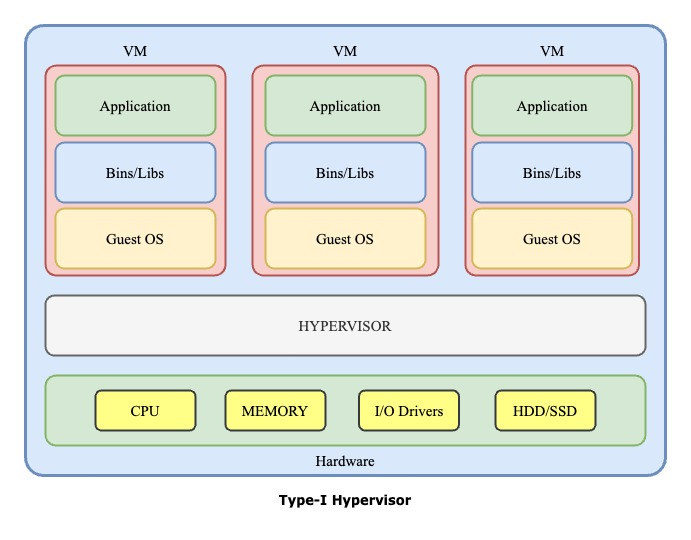
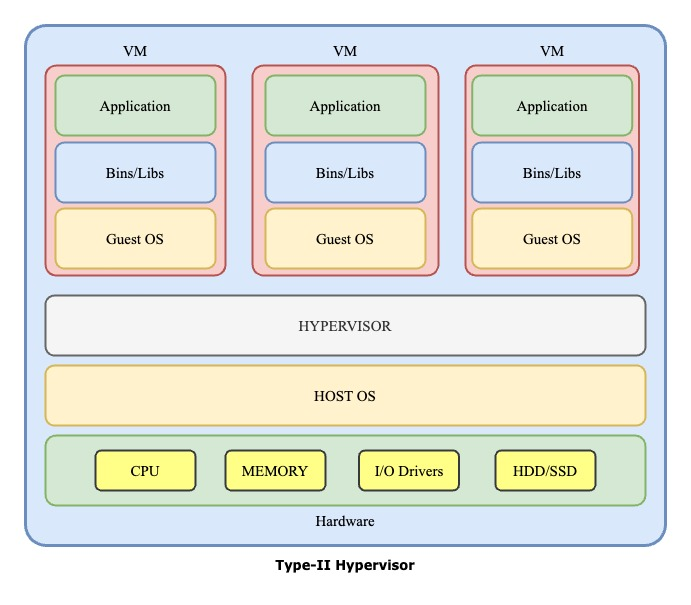

| ASPECT          | Type-1 Hypervisor                                                      | Type-2 Hypervisor                                        |
| --------------- | ---------------------------------------------------------------------- | -------------------------------------------------------- |
| Known As        | Bare-metal hypervisor                                                  | Hosted hypervisor                                        |
| Installation    | Directly on hardware                                                   | On top of an existing OS                                 |
| Host OS         | No host OS required                                                    | Requires a host OS                                       |
| Performance     | Generally better performance                                           | Slightly lower performance due to OS overhead            |
| Resource access | Direct access to hardware resources                                    | Access through host OS                                   |
| Use cases       | Enterprise servers, data centers                                       | Personal use, development, testing                       |
| Examples        | VMware ESXi, Microsoft Hyper-V (native), Citrix Hypervisor, Proxmox VE | VMware Workstation, Oracle VirtualBox, Parallels Desktop |
| Security        | Generally more secure                                                  | Potentially less secure due to host OS vulnerabilities   |
| Management      | Dedicated management interfaces                                        | Often managed through host OS                            |
| Scalability     | Highly scalable for large deployments                                  | Limited by host OS capabilities                          |
# Architechture with Hypervisor Type-1

# Architechture with Hypervisor Type-2

[Goto Main](../README.md)
