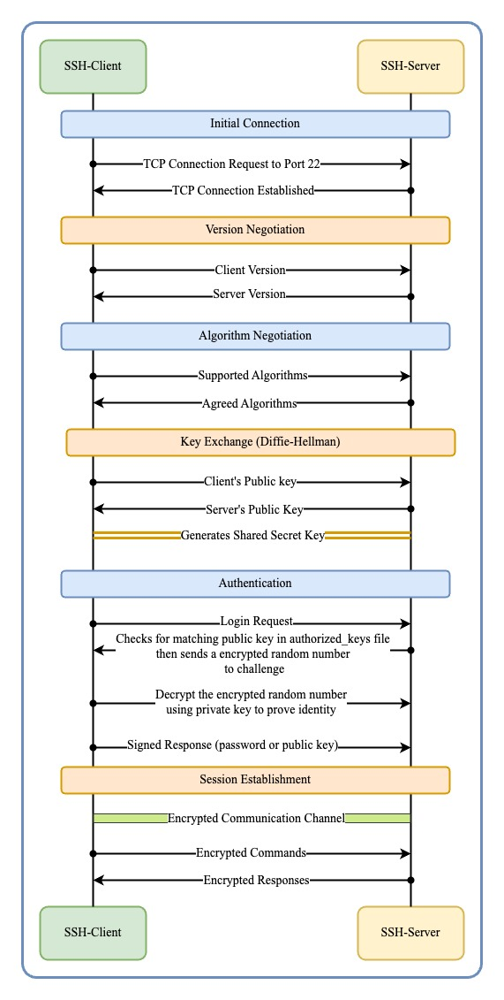

# Introduction
**SSH (Secure Shell)** is a cryptographic network protocol used to securely access and manage devices, servers, or systems over an unsecured network. It provides strong authentication and encrypted communication, ensuring data integrity and confidentiality during remote operations.
# Functions of SSH

| Features                 | Functional Description                                                                                                            |
| ------------------------ | --------------------------------------------------------------------------------------------------------------------------------- |
| Secure Remote Login      | SSH enables secure login to remote systems, replacing less secure protocols like Telnet or rlogin.                                |
| Encrypted Communication  | Data between the client and server is encrypted to prevent eavesdropping or man-in-the-middle attacks.                            |
| Port Forwarding          | Can be used for tunneling, allowing users to secure other types of communication (e.g., database connections).                    |
| File Transfers           | Provides secure file transfer capabilities using protocols like SCP (Secure Copy Protocol) and SFTP (SSH File Transfer Protocol). |
| Key-based Authentication | Public-Private key authentication for enhanced security, reducing reliance on passwords                                           |
| Command Execution        | A user can execute commands on remote servers without logging in interactively.                                                   |
# Overview of the SSH working
