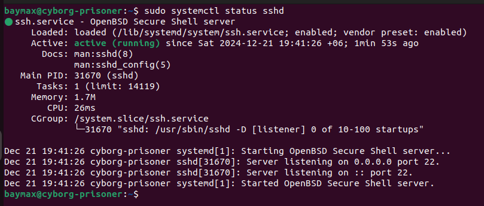
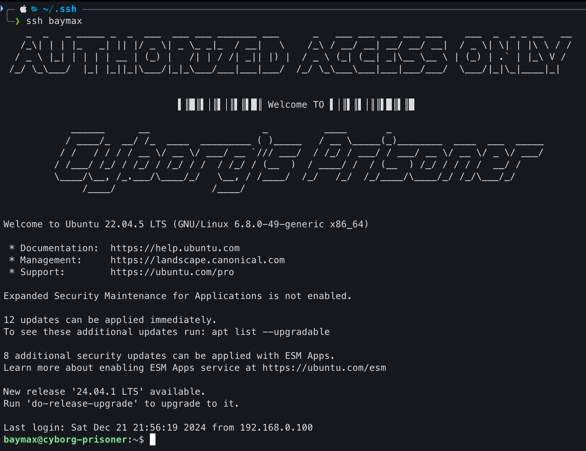

# Setting Up your PC with OpenSSH for Remote Access
# Overview of OpenSSH

- OpenSSH is a remote management tool that connect to remote servers securely via SSH.
- Developed by the OpenBSD project, it is a standard feature in most Linux distributions.
- Consists of server (`sshd`) and client (`ssh`) components.
## Installing OpenSSH 
### Check if `openssh-server` previously installed 
```bash
dpkh -l | grep openssh-server
```

### Install `openssh-server` 
```bash
sudo apt install openssh-server -y
```
### Check of the installation
```bash
sudo systemctl status sshd
```

 
## Configure the `openssh-server`
### File that we have to know about
The configuration files located in this directory `/etc/ssh` , in this directory you may see following files:


| File Name                        | Purpose                                                                                                                                                                                    |
| -------------------------------- | ------------------------------------------------------------------------------------------------------------------------------------------------------------------------------------------ |
| **`sshd_config`**                | **Server Configuration** <br>- Controls SSH server behavior (e.g., port, root login, authentication methods). <br>- Changes require restarting the SSH service.                            |
| `ssh_config`                     | **Client Configuration** <br>- Sets global SSH client settings (e.g., default identity files, host-specific options).                                                                      |
| `ssh_host_<type>_key `and `.pub` | **Host Keys**<br>- Private (.key) and public (.pub) keys for server identification. <br>- Types include RSA, ECDSA, and ED25519. <br>- From this you can know which algorithm it supports. |
| `moduli`                         | **Diffie-Hellman Parameters** <br>- Provides secure parameters for key exchange.                                                                                                           |
### Permissions:

- Private keys: Secure (`0600`), root-only access.
- Public keys and config files: World-readable (`0644`).

These files enable secure SSH operations and allow fine-tuning of server and client behavior.

### Backup Existing Configuration of the Server `sshd_config`

```bash
sudo cp /etc/ssh/sshd_config /etc/ssh/sshd_config_$(date +%F_%T).bak
```

why this backup, because we don’t need the whole config we will rewrite the minimal setup config on our own and will understand each of them line by line.

### Rewriting The Config file

```bash
# This line is used for adding the config files that were defined
# into the sshd_config.d folder
Include /etc/ssh/sshd_config.d/*.conf

# This line is used to define the port(i.e default port 22) in which 
# the ssh server will listen
Port 22

# This line is used to define the address of the NIC from which the packets enter
ListenAddress 192.168.0.117

# By this line you specify the host keys with algorithm types which will be used 
# to decrypt the data (according to the client side key algorithm type)
# otherwise it will lookup for all of the keys in the /etc/ssh directory
HostKey /etc/ssh/ssh_host_ed25519_key

# Logging

# Specifies that SSH authentication logs should use the AUTH facility of syslog
SyslogFacility AUTH
LogLevel INFO

# Authentication:
# To enable public key auth
PubkeyAuthentication yes
# We will be using key based login so we donot need to enable password auth
PasswordAuthentication no

# Specifies a file containing a message to be displayed before authentication
Banner /etc/ssh/issue.net

# Allow client to pass locale environment variables
AcceptEnv LANG LC_*

# Configures the SFTP (Secure File Transfer Protocol) subsystem
# Specifies the path to the SFTP server program 
# Enables secure file transfer functionality
Subsystem	sftp	/usr/lib/openssh/sftp-server
```

**Note :** you have to create `key_pairs` on the client side using the same algorithm you add here (i.e ed25519). Also I gave `192.168.0.117` it's a private IP, I used this because this VPS is only for my PoC. But using `port-forwarding` we can make it public or can assign a public IP from `ISP's`.
## Accessing the Server 
### Create `key-pairs` on client-side
```bash
ssh-keygen -t ed25519 -C "<a_identifier can be a mail>"
```
Note: Can use passphrase for better security.
After running this upper command in this `~/.ssh/` directory you will notice your key_pairs. Now copy the content of the public key file

```bash
cat ~/.ssh/<name_of_key>.pub
```
Copy the content of the output by the upper command.
## Paste the content on the server-side
If the `.ssh` folder is not available you have to create one using `mkdir`.

```bash
sudo nano ~/.ssh/authorized_keys
```

Paste the content of the public key what you have just copied.

**Alternative Approach to copy the public key from the client-side is**

```bash
ssh-copy-id -i <name_of_key_from_the_created_key_pairs> <username>@<server_ip>
```
### Remembering the `ip-address` all the time is Painful What to do?
we can write a `config` file and access using a `hostname` , you can create a config file like below on the `client-side`

```bash
touch ~/.ssh/config
```

Then using `nano` write a `config` like below :

```bash
Host <host_name>
  Hostname <server_ip>
  User <username>
  IdentityFile <path_to_the_private_key_from_the_created_key_pairs>
  IdentitiesOnly yes
```

Now you can `ssh` into your server using simple command :

```bash
ssh <host_name>
```

This is how after `ssh` into your `server` will look like as per your **config** from the `client` side
 

[Goto Main](../README.md)
