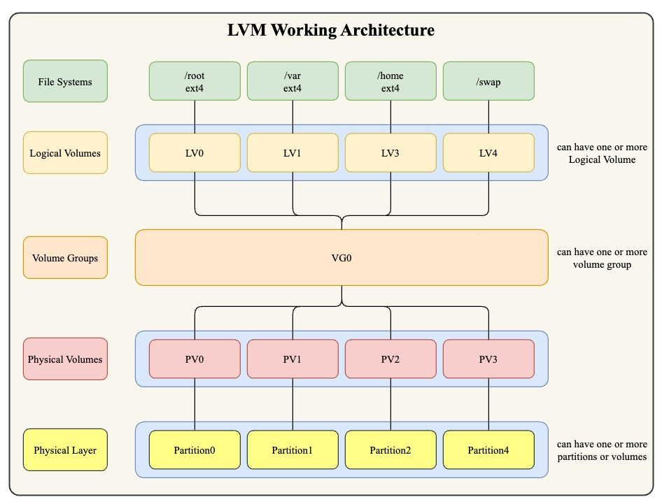

# Logical Volume Management (LVM)
# Introduction

Logical Volume Management (`LVM`) is a tool in Linux that makes managing disk space easier. It combines **multiple disks or partitions** into one or more virtual storage units. This allows you to adjust storage size and organize data more flexibly, without being limited by physical disk sizes.

**Note :** Can be used for almost **any mount** point except `/boot` (because **GRUB cannot read LVM metadata**)
# Benefits of Using LVM

1. **Flexibility**
    - Resize volumes easily (grow or shrink as needed).
    - Manage `storage pools` dynamically.
		    

			    

			    Storage Pools
				 

				 A storage pool is a collection of physical storage devices (like hard drives or SSDs) that are combined into a single logical unit. This pooled storage can then be divided into smaller, flexible storage volumes or used as one large space.
		    

    - `Migrate` data between disks **without downtime**.
    - Support for **snapshots for backups or testing.**
2. **Ease of Management**
    - **Centralized storage control**.
    - Add or remove disks effortlessly.
    - Simple **command-line tools for administration**.
3. **Improved Performance**
    - Distribute data across multiple disks for faster access (striping).
    - Use **caching for better speed**.
    - Thin provisioning for efficient storage use.
4. **Reliability**
    - Snapshots for safe backups.
    - Mirror volumes for data redundancy.
    - Automatically handle bad blocks.
    - Support for `hot-swapping` disks.

**Note :** LVM is especially helpful for managing locations like `/var` where disk usage can grow quickly.
# LVM Working Architechture and Components

Logical Volume Manager (LVM) provides flexible disk management by layering its components as follows:

1. **Physical Volumes (PV)**:
    These are the actual storage devices, like hard drives, SSDs, or partitions. They are divided into fixed-size blocks called _Physical Extents (PE)_ after being initialized for LVM.
    
2. **Volume Groups (VG)**:
    A _Volume Group_ is created by combining one or more Physical Volumes. This forms a storage pool from which space can be allocated. All PVs in a VG share the same PE size, making management consistent.
    
3. **Logical Volumes (LV)**:
    Logical Volumes act like partitions and are created from the storage pool in the Volume Group. They are made up of _Logical Extents (LE)_, which are directly mapped to Physical Extents. Logical Volumes can span multiple disks and be resized without disrupting their use.
    
4. **File Systems**:
    On top of Logical Volumes, file systems like ext4 or XFS are created and mounted for data storage.
### How It Works:

Physical storage is initialized as PVs, grouped into VGs, and divided into LVs

# Challenges and Considerations in Using LVM

### 1. **Technical Challenges**

|Challenges|Description|
|---|---|
|**Complexity**|LVM adds an extra layer of management, making setup and recovery harder. For example, if a disk fails, recovering LVM volumes is more complex than traditional partitions. Administrators need to learn how LVM works.|
|**Performance Overhead**|LVM slightly slows down system performance due to extra processing for mapping data between physical and logical storage. This might be noticeable on systems with high disk usage or limited CPU power.|
|**Recovery**|If LVM metadata (used to track storage structure) gets corrupted, recovering data can be tough without special LVM tools. For instance, losing metadata may result in partial or complete data loss unless backups exist.|
|**Maintenance Overhead**|Regular checks are needed to ensure enough free space in Volume Groups, manage snapshots to avoid running out of storage, and keep backups of metadata. For example, ignoring snapshot management can fill up space and crash systems.|

### 2. **Operational Considerations**
|Considerations|Description|
|---|---|
|**Planning**|You must carefully decide the size of storage units (extents) and allocate space for features like snapshots. For example, not planning for snapshot space can lead to errors when creating them.|
|**Backup**|Backups must consider LVM’s structure. Using regular tools may not work properly, so LVM-aware solutions are necessary. Regularly backing up metadata helps prevent loss during failures.|
# Hands On Commands
- [Documentation for Commands](./lvm_commands.md)
