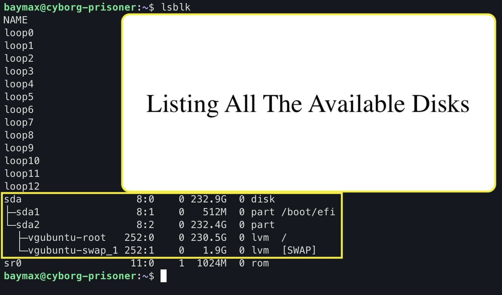
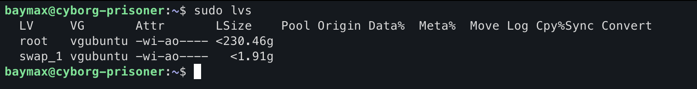
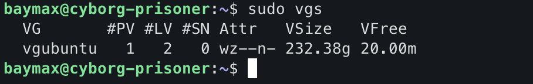
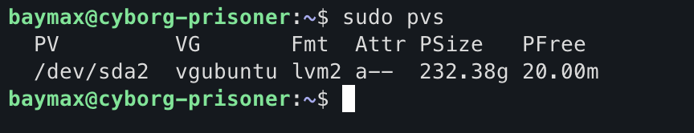
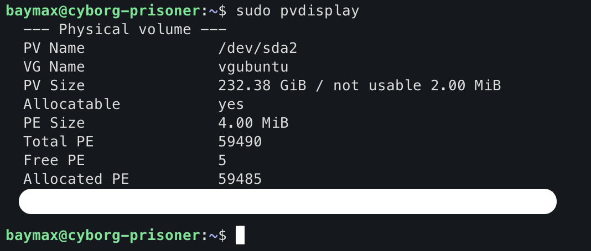
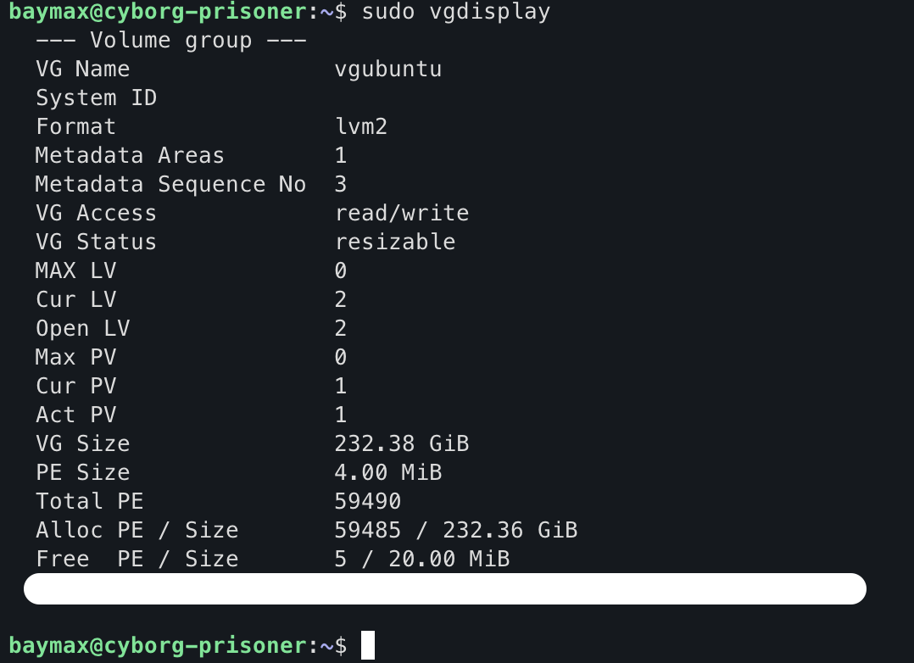
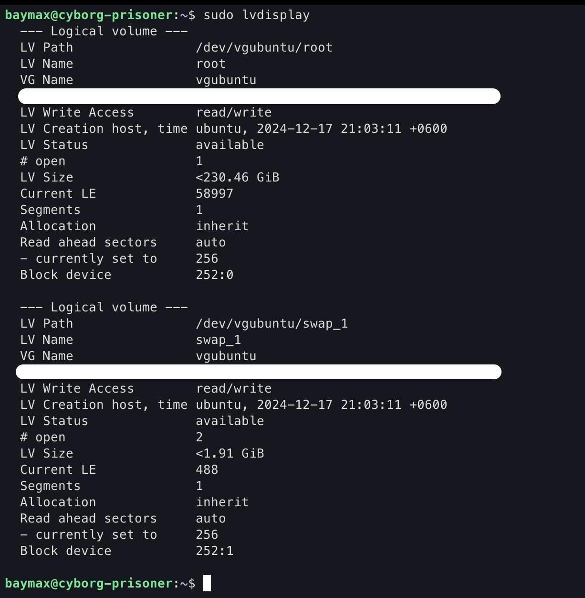

# Table of Contents
- [Show Disks](#show-disks-on-machine)
- [Listing Logical Volumes](#listing-logical-volumes)
- [Listing Volume Groups](#listing-volume-groups)
- [Listing Physical Volumes](#listing-physical-volumes)
- [Get Details About Volumes and Groups](#details-about-volumes-and-groups)
- [Physical Partition to Physical Volume](#physical-partition-to-physical-volume)
- [Manual Creation with Permanent Mounting](#manual-creation-with-permanent-mounting)

# Show Disks on Machine

To see the available disks on your machine 
```bash
lsblk
```


Here my actual **physical** layer `SSD` is `sda` which is further partitioned into `sda1` and `sda2`, Then using `LVM` **sda2** converted into a physical volume and created a volume group called `vgubuntu` where two logical volumes are there one is `root` and other is `swap_1`.
# Listing Logical Volumes
You can verify this using below command:

```bash
sudo lvs
```

This will list the all logical volumes in you machine.


# Listing Volume Groups

You can also list the volume groups in your machine by:

```bash
sudo vgs
```


# Listing Physical Volumes

You can also list the physical volume in your machine by:

```bash
sudo pvs

```


# Details About Volumes And Groups

## Physical Volumes

```bash
sudo pvdisplay
```


## Volume Groups

```bash
sudo vgdisplay
```


## Logical Volumes

```bash
sudo lvdisplay
```


# Physical Partition to Physical Volume
## Creation of New Physical Volume

```bash
sudo pvcreate <partition_path>
```

This will create a fresh physical volume out of you physical partition.
## Adding New Physical Volume to Existing Volume Groups

```bash
sudo vgextend <volume_group_name> <partition_path>
```
Verify your update by encounter `sudo vgdisplay`.
## Extending the Logical Volume from newly added physical volume 

```bash
sudo lvextend -L +<amount>G <logical_volume_path>
```
By doing this you just initiate the process of extending, you have to resize the `fs` also, to do that

```bash
sudo resize2fs <logical_volume_path>
```
To verify this you can use `sudo lvdisplay` or `df -h`.
# Manual Creation with Permanent Mounting

## Step-1 Add a Physical Disk or Partition To Your Machine

- Add manually or create a partition on the existing Physical Disks.
## Step-2 Convert the disk to an LVM Physical Volume

```bash
sudo pvcreate <physical_disk_path>
```

- This command initializes the disk (or partition) as a physical volume (PV) for LVM.
## Step-3 Create Volume Group

```bash
sudo vgcreate <volume_group_name> <physical_disk_path>
```

- This command combines one or more physical volumes into a single pool called a volume group (VG).
- The created storage pool can be subdivided into Logical Volumes (LV).
## Step-4 Verifying the Creation of  Volume Group

```bash
sudo vgdisplay
```
## Step-5 Create a Logical Volume

```bash
sudo lvcreate <volume_group_name> -L <size>G -n <logical_volume_name>
```

- Allocates `<size>` GB from the volume group to create a logical volume with the given name.
## Step-6 Format the Logical Volume

```bash
sudo mkfs.ext4 <logical_volume_path>
```

- Creates an ext4 filesystem on the logical volume
- Prepares the logical volume to store files.
## Step-7 Create a Mount Directory

```bash
sudo mount <logical_volume_path> <mount_path>
```

-  Temporarily mounts the logical volume to the specified directory.
- The logical volume can be accessed through `<mount_path>`
## Step-8 Find the Block-ID (UUID)

```bash
blkid <logical_volume_path>
```

- Retrieves the unique identifier (UUID) for the logical volume
- This UUID is used for permanent mounting in `/etc/fstab`
## Step-9 Backup the `/etc/fstab` 

```bash
sudo cp /etc/fstab /etc/fstab.bak
```

- This backup is made if any error occurs in further process we can resume where we left off.
## Step-10 Edit the `/etc/fstab`

```bash
sudo nano /etc/fstab
```

- Add a new line to automatically mount the volume at boot using the UUID on the specified `<mount_path>`.
- This process makes the mount permanent.
## Step-11 Testing the Mount

```bash
sudo umount <mount_path>
sudo mount -a
```

- Unmounts the logical volume and tests the `/etc/fstab` file using `mount -a`.
- If no errors occur, the configuration is correct, and the volume will mount automatically on reboot.

There is lot more stuffs on `LVM` you can check this out [Doc](https://liquidweb.com/blog/lvm-in-linux-to-manage-storage-devices)

[Goto Main](../README.md)
