# Launch a VM Manually

Continue all the process on your host machine in which you want to create the `vms`.
## Check before proceed

```bash
virsh list --all
```

If you didn't launch any `vm` before the output will be shown like below

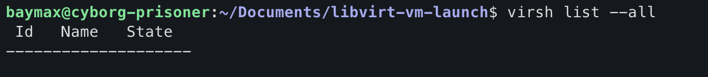

```bash
virsh vol-list vgubuntu-storage-pool
```

Replace `vgubuntu-storage-pool` by your storage-pool name. If didn't launch any `vm` before the output will be shown like below

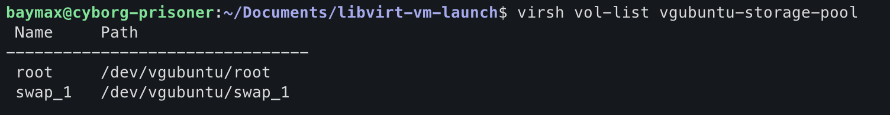
# Now steps to launch vm
## Step-1 Create a disk in the storage pool

```bash
virsh vol-create-as vgubuntu-storage-pool <disk_name> <disk_size>G --format raw
```

I have created `20GB` disk named `lv-ubuntu2404`.

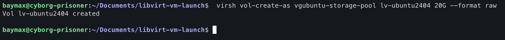
### Verify this creation

```bash
virsh vol-list vguubuntu-storage-pool
```

Now in the given list you will see an entry of `lv-ubuntu2404`.
## Step-2 Install `virt-install` and `virt-viewer`

In for `ubuntu` distributions it comes with `virtinst` package.

```bash
sudo apt update && sudo apt install virtinst -y
```

## Step-3 Download an iso file for you VM

Here, I have downloaded an Ubuntu Iso from `mirros.mit.edu`.

```bash
wget -o ubuntu-24-04.1-live-server-amd64.iso https://mirrors.mit.edu/ubuntu-releases/24.04/ubuntu-24.04.1-live-server-amd64.iso
```

You can download this `iso` in any folder of you machine.

## Step-4 Launch VM using `virt-install` command

```bash
virt-install \
	--name ubuntu2404 \
	--ram 2048 \
	--vcpus 2 \
	--disk /dev/vgubuntu/lv-ubuntu2404 \
	--cdrom /var/lib/libvirt/isos/ubuntu-24.04.1-live-server-amd64.iso \
	--os-variant generic \
	--console pty,target_type=serial
```

Here the flags denotes
`--name` : name of your vm
`--ram` : size of your memory in vm
`--vcpus` : number of virtual cpus in your vm
`--disk` : from which disk it will allocate it's memory
`--cdrom` : OS to use
`--console` : for accessing the terminal.

Once you run the `virt-install` command like above, a `virt-viewer` window should pop up with the installer running, go ahead and follow the installation wizard to install the `OS`. You will face the below `GUI` throughout the process.

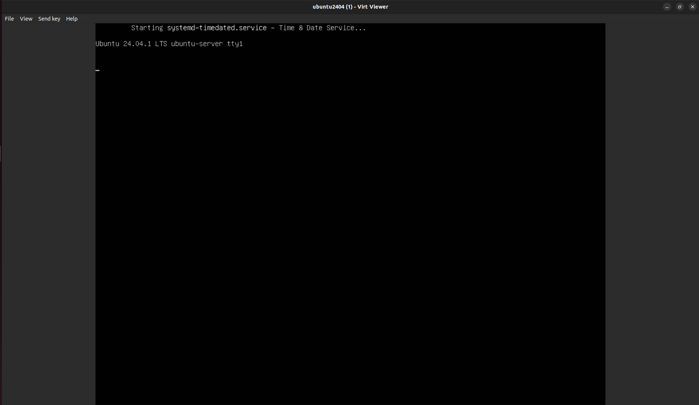

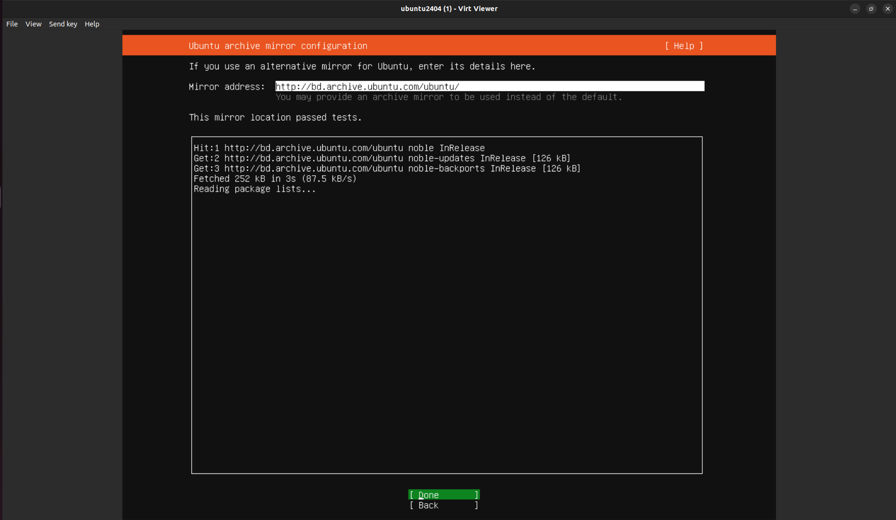


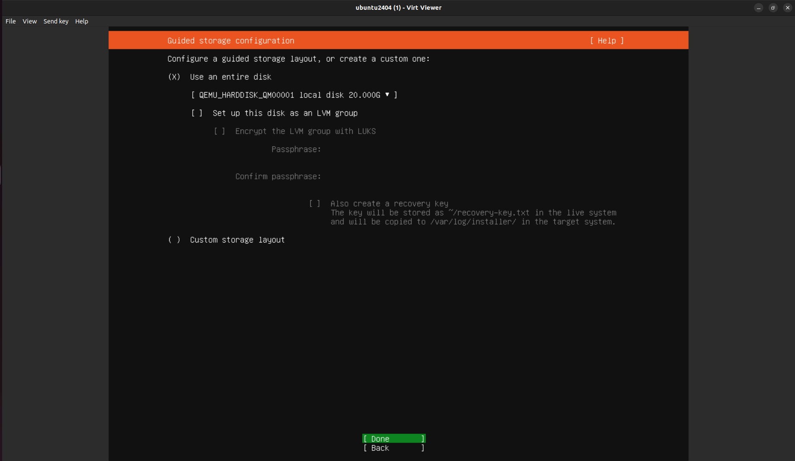

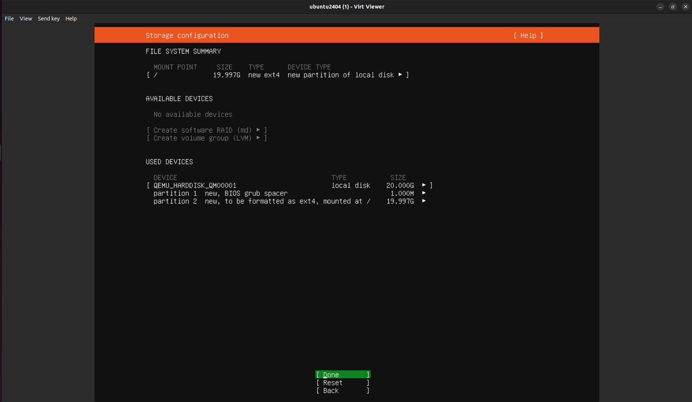

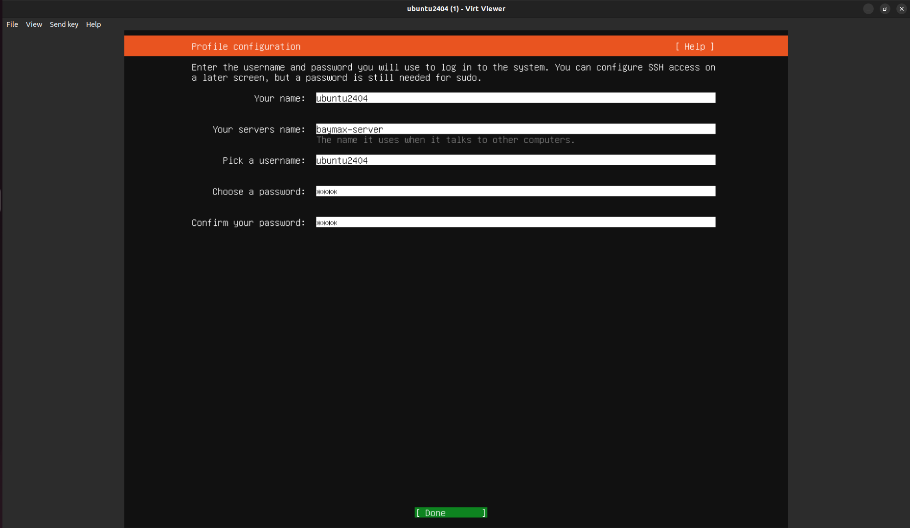

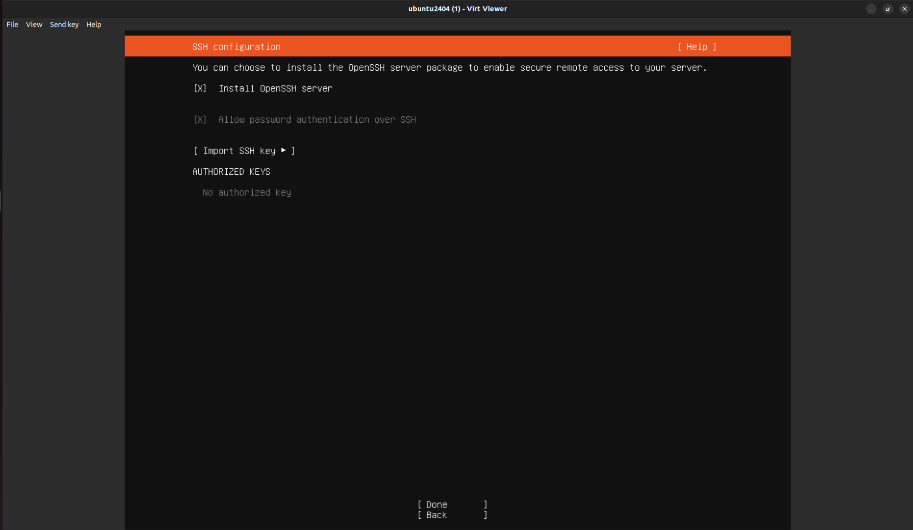

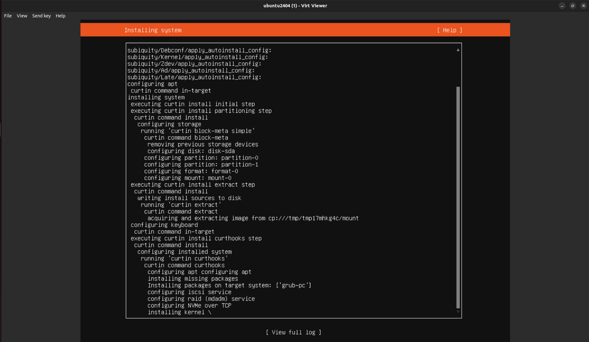

You can open the `vm` anytime later by running following command:

```bash
virt-viewer ubuntu2404
```

Here, `ubuntu2404` is the name of the `VM`. 

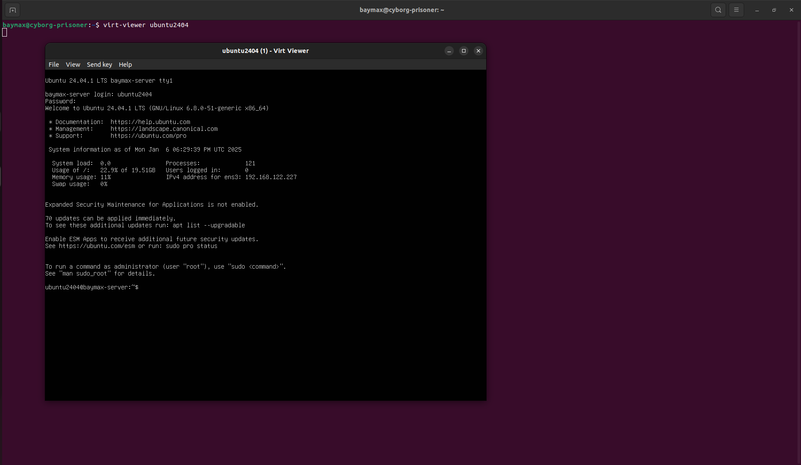
