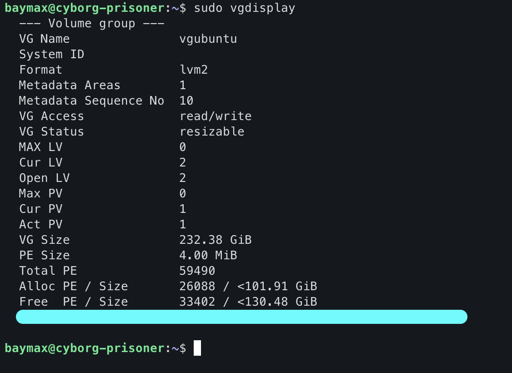
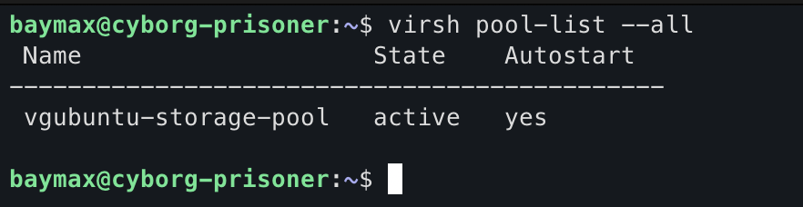

# Setting Up Storage Pool For libvirt

In the begining of this `VPS-PoC` project I have setted up the `lvm` for managing logical volumes. I also have created a volume group called `vgubuntu`. And we have some free storage in that volume group. We will utilize the free spaces in this process.
## Step-1 Verify Logical Volume Group 

```bash
sudo vgdisplay
```


`Free PE / Size` shows the information about the free storage that can be used for create LVs (logical volumes).
## Step-2 Create a storage pool XML file

```xml
<pool type='logical'>
  <name>vgubuntu-storage-pool</name>
  <source>
    <name>vgubuntu</name>
  </source>
  <target>
    <path>/dev/vgubuntu</path>
  </target>
</pool>
```

This XML defines a **libvirt storage pool** using **LVM** (Logical Volume Manager).
- **`<pool type='logical'>`**: The pool type is `logical`, meaning it uses LVM volumes.
- **`<name>vgubuntu-storage-pool</name>`**: The name of the pool is `vgubuntu-storage-pool`.
- **`<source><name>vgubuntu</name></source>`**: The pool is backed by the **volume group** `vgubuntu` in LVM.
- **`<target><path>/dev/vgubuntu</path></target>`**: This specifies where the LVM volumes are located, in this case, under `/dev/vgubuntu`.

**Now** save this config anywhere you want called `vgubuntu-storage-pool.xml` (can give any name). 
## Step-3 Define and Start the Pool

```bash
virsh pool-define vgubuntu-storage-pool.xml
virsh pool-start vgubuntu-storage-pool
virsh pool-autostart vgubuntu-storage-pool
```

To verify this setup :

```bash
virsh pool-list --all
```



## What happens after defining this storage pool in libvirt?

1. **Libvirt associates the pool with the `vgubuntu` volume group**
    - It allows libvirt to manage logical volumes within the VG (volume group) for VM storage.
    - Logical volumes will appear as block devices under `/dev/vgubuntu`.
2. **VM Disk Allocation**
	- When creating a new VM, a logical volume can be allocated in this pool.
	- Example volume path for a VM `/dev/vgubuntu/myvm-disk`.

[Goto Main](../README.md)
