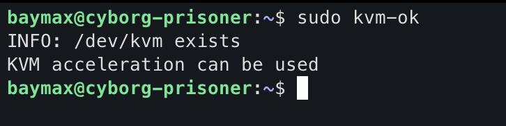

# Setup HOST for virtualization
## Verify support for Virtualization

```bash
lscpu | grep "Virtualization"
```


If you see this type of output then you're good to proceed.
## Enable Virtualization from BIOS
Goto your `BIOS` and enable the virtualization after going to **Advanced Mode**.  This process may vary depending on your device Brand.
## Ensuring Virtualization is Enabled

```bash
egrep -c '(vmx|svm)' /proc/cpuinfo
```


If you see value more than 0 then you're good to go.
## Install necessary packages

```bash
sudo apt update
sudo apt install qemu-kvm libvirt-daemon libvirt-clients libvirt-daemon-system bridge-utils 
```
## Checking KVM is Installed and Enabled

```bash
sudo kvm-ok
```



## Start and enable the `libvirtd` service

```bash
sudo systemctl enable --now libvirtd
```

## Add your user to the `libvirt` and `kvm` groups for permission

```bash
sudo usermod -aG libvirt,kvm $USER
```

Now reboot your system to take effect.

[Goto Main](../README.md)