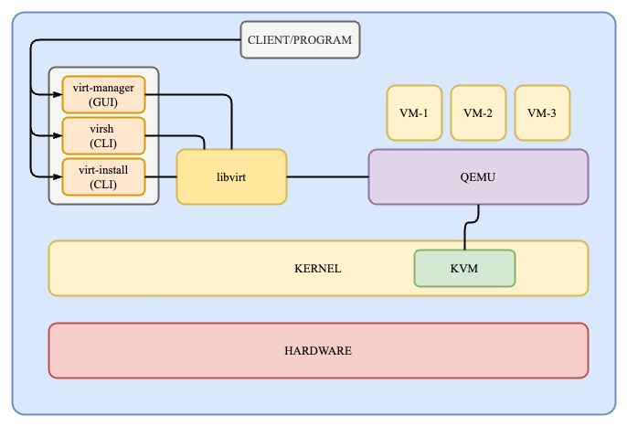

# Tools for Virtualization

There are many tools which offers virtualization like KVM, ESXi, Hyper-V, qemu, xen.... . In my setup, I like to think, is fairly minimal and let's me get everything I need done. The tools are as follows.

**key system tools:**

These are the key tools/services/features that enable virtualization.

- **[kvm](https://www.linux-kvm.org/page/Main_Page)**:
    - Kernel-based Virtual Machine.
    - Kernel module that handles CPU and memory communication.
    - It turns the Linux kernel into a Type-1 hypervisor, enabling VMs to use the host's hardware directly (e.g., CPU, memory).
- **[qemu](https://www.qemu.org/)**:
	- QEMU is a user-space application that emulates hardware for virtual machines.
	- It provides an environment where guest operating systems can run as though they were on real hardware.
	- Works with or without KVM:
	    - Without KVM: QEMU fully emulates the CPU and other hardware, but it's slower.
	    - With KVM: QEMU delegates CPU virtualization to KVM, achieving near-native performance.
	 - **How it Works:**
		- **Emulation:** Emulates devices (disk, network, USB, graphics) to provide a virtualized environment for the guest OS.
		- **Binary Translation:** If KVM is unavailable, QEMU translates guest CPU instructions to host CPU instructions.
		- **Acceleration:** When paired with KVM, QEMU focuses on I/O device emulation while KVM handles the CPU and memory.
- **[libvirt](https://libvirt.org/)**:
    - Libvirt is an API, daemon (`libvirtd`), and CLI tool (`virsh`) for managing virtualization platforms.
    - Provides a unified way to manage virtualization backends, such as QEMU/KVM, Xen, and LXC.
    - Simplifies VM lifecycle management: create, define, start, stop, migrate, and delete VMs.
    - **How it Works:**
		- **Daemon (`libvirtd`)**: Communicates with the host's hypervisor (e.g., QEMU/KVM) to manage virtual machines.
		- **APIs**: Provides a standardized interface for applications to interact with virtualization platforms.
		- **Abstraction**: Hides the complexity of low-level QEMU commands, making VM management easier.
**user/client tools:**

These tools can be interacted with by users / services.

- **[virsh](https://libvirt.org/manpages/virsh.html)**
    - Command-line tools for communicating with libvirt
- **[virt-manager](https://virt-manager.org/)**
    - GUI to manage KVM, qemu/kvm, xen, and lxc.
    - Contains a [VNC](https://en.wikipedia.org/wiki/Virtual_Network_Computing) and [SPICE](https://en.wikipedia.org/wiki/Simple_Protocol_for_Independent_Computing_Environments) client for direct graphical access to VMs.
    - GUI alternative to `virsh`, albeit less capable.
- **[virt-install](https://linux.die.net/man/1/virt-install)**
    - Helper tools for creating new VM guests.
    - Part of the `virt-manager` project.
- **[virt-viewer](https://linux.die.net/man/1/virt-viewer)**
    - UI for interacting with VMs via VNC/SPICE.
    - Part of the `virt-manager` project.

These tools are used to support the system tools listed above.

- `dnsmasq`: light-weight DNS/DHCP server. Primarily used for allocating IPs to VMs.
- `dmidecode`: prints computers SMBIOS table in readable format. Optional dependency, depending on your package manager.
- `iptables`: used for setting up NAT networking the host.
- `bridge-utils`: used to create bridge interfaces easily. (tool has been [deprecated since 2016}(https://lwn.net/Articles/703776), but still used)
- `openssh-server`: enables remote management over SSH.

 At a high-level, this diagram demonstrates the key relationships to understand:

## **How These Components Work Together**

1. **KVM Provides Virtualization:**
    - KVM handles the low-level hardware virtualization (CPU, memory).
2. **QEMU Emulates Hardware:**
    - QEMU sets up the virtual environment (e.g., disks, network cards) for the guest OS.
    - If KVM is enabled, QEMU offloads the CPU and memory virtualization to KVM for better performance.
3. **Libvirt Manages Everything:**
    - Libvirt interacts with QEMU and KVM to define and manage VMs.
    - Provides a unified interface for tools like `virsh`, GUIs like Virt-Manager, and programming languages through bindings (e.g., `libvirt-go`).

[Goto Main](../README.md)