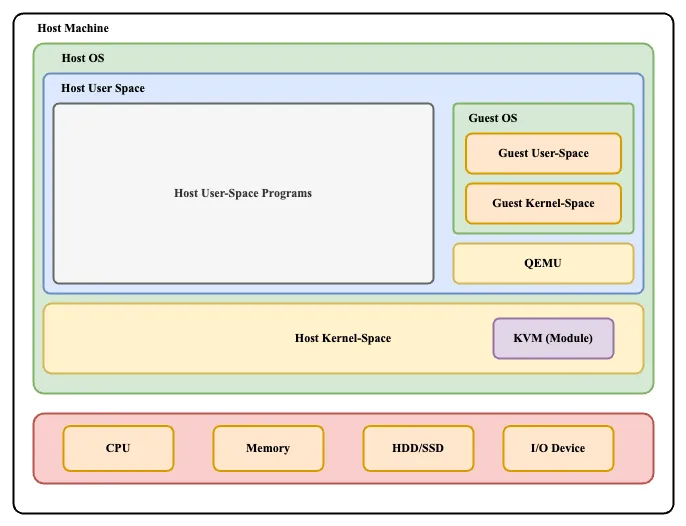

# KVM  ( Kernel-based Virtual Machine )

## What is KVM
Kernel-based Virtual Machine (KVM) is an open source [virtualization](https://www.redhat.com/en/topics/virtualization/what-is-virtualization) technology for Linux® operating systems. With KVM, Linux can function as a [hypervisor](https://www.redhat.com/en/topics/virtualization/what-is-a-hypervisor) that runs multiple, isolated [virtual machines (VMs)](https://www.redhat.com/en/topics/virtualization/what-is-a-virtual-machine).
## What does a Hypervisor do?
**Virtualization** allows one OS to run inside another using a hypervisor, which manages resources like CPU, memory, and storage for multiple virtual machines (VMs). The physical machine running the hypervisor is called the host, while the VMs are the guests. 
`Hypervisors` need operating system-level components—such as a memory manager, process scheduler, input/output (I/O) stack, device drivers, security manager, a network stack, and more—to run VMs. `KVM` has all these components because it’s part of the **Linux kernel**. Every VM is implemented as a regular Linux process, scheduled by the standard Linux scheduler, with dedicated virtual hardware like a network card, graphics adapter, CPU(s), memory, and disks.
## How KVM Works

KVM works by using the Linux kernel’s process scheduling and memory management system to provide resources to the virtual machines. Here's a breakdown of how KVM works:

1. **Kernel Module**:
    
    - KVM is implemented as a kernel module (`kvm.ko`) in Linux. This kernel module exposes the virtualization capabilities to the user-space programs (such as `qemu` or `libvirt`), allowing them to manage virtual machines.
2. **Hardware Virtualization Support**:
    
    - KVM takes advantage of hardware-assisted virtualization features built into modern CPUs (like Intel VT-x and AMD-V). These technologies allow KVM to run virtual machines more efficiently by providing direct access to the CPU for the VMs.
3. **Virtual Machine as a Process**:
    
    - Each VM in KVM is treated as a regular Linux process, scheduled by the Linux scheduler. However, KVM provides each VM with its own isolated virtual environment, including a virtual CPU (vCPU), memory, storage, network interface, and other virtual hardware components.
4. **QEMU (Quick Emulator)**:
    
    - KVM typically works with QEMU, a user-space emulator that provides the emulation of devices and manages the virtual hardware for each VM. QEMU allows for running the virtual machine as if it were a physical system by providing device emulation, such as virtual disks, network adapters, and graphics.
5. **I/O Virtualization**:
    
    - KVM uses various methods for I/O virtualization, such as **virtio** (a framework for paravirtualized I/O devices). Virtio allows for efficient communication between the guest OS and the hypervisor, improving performance by bypassing some of the need for emulation.
6. **Memory Management**:
    
    - KVM uses a memory management technique called **memory overcommit**. It allows the host to allocate more memory than physically available by using memory paging and swapping. Additionally, KVM uses **KSM (Kernel Same-page Merging)**, which allows multiple VMs to share identical memory pages, optimizing memory usage.
7. **Device Emulation**:
    
    - KVM provides virtual hardware devices (such as virtual network cards, disk drives, etc.) through QEMU or the **virtio** framework. These devices allow guest OSes to function as if they were on real hardware.

## Key Features

- **Isolation**: Strong separation between VMs.
- **High Performance**: Utilizes hardware virtualization for near-native performance.
- **Live Migration**: Move running VMs between hosts without downtime.
- **Scalability**: Can support many VMs on a single host.
- **Security**: Integrated with Linux kernel security features like SELinux.
- **Snapshot and Cloning**: Create VM snapshots or clones.
- **Flexible Networking**: Supports various network configurations.
- **Management Tools**: Integrates with tools like `libvirt`  for easier VM management.
## Use Cases

- **Cloud Computing**: Powering platforms like OpenStack.
- **Testing and Development**: Isolated environments for app testing.
- **Server Consolidation**: Reduces hardware by running multiple VMs on one server.

KVM is a highly efficient, scalable, and secure solution for virtualization, widely used in cloud, development, and production environments.
## References
- [KVM](https://linux-kvm.org/page/Main_Page)
- [RedHat Topics](https://www.redhat.com/en/topics/virtualization/what-is-KVM)